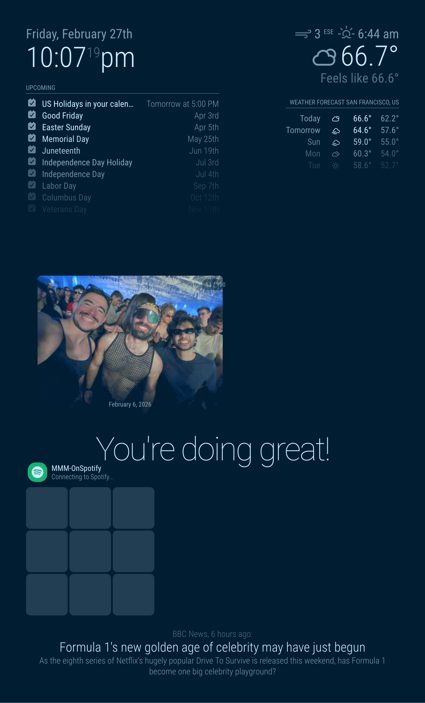

# MMM-SynologyPhotos

A [MagicMirror²](https://magicmirror.builders/) module that displays photos from your **Synology Photos** library as a slideshow on your smart mirror.




## Features

- **Personal Space & Shared Space** — Browse photos from either space
- **Album / Folder filtering** — Show photos from a specific album or folder
- **Crossfade slideshow** — Smooth transitions between photos
- **Shuffle & sort** — Randomize or sort by date
- **Auto-refresh** — Periodically re-fetches photos from your NAS
- **Metadata overlay** — Optionally show filename and date taken
- **Flexible sizing** — Presets (small/medium/large/xlarge/fullscreen) or custom pixel dimensions
- **Auto thumbnail quality** — Automatically selects the best resolution for your widget size

## Installation

### Via MMPM (recommended)

```bash
mmpm install MMM-SynologyPhotos
```

### Manual install

```bash
cd ~/MagicMirror/modules
git clone https://github.com/zarif98/MMM-SynologyPhotos.git
cd MMM-SynologyPhotos
npm install
```

## Test Your Connection

Before configuring the module, run the built-in diagnostic tool to verify your NAS is reachable and your credentials work:

```bash
cd ~/MagicMirror/modules/MMM-SynologyPhotos
node test_connection.js <server> <username> <password> [otp_code]
```

**Examples:**

```bash
# QuickConnect
node test_connection.js mynas.quickconnect.to myuser mypass

# Direct LAN IP
node test_connection.js 192.168.1.100:5001 myuser mypass

# With 2FA OTP code (first time only — saves a device token)
node test_connection.js mynas.quickconnect.to myuser mypass 913484
```

> **Note:** If your Synology account has 2FA enabled, run `test_connection.js` with your OTP code as the 4th argument. This saves a device token so the module can log in without OTP in the future. If you ever reset 2FA, re-run with a new OTP code.

## Configuration

Add the following to the `modules` array in your `config/config.js`:

```javascript
{
  module: "MMM-SynologyPhotos",
  position: "middle_center",       // any MagicMirror² region
  config: {
    serverUrl: "192.168.1.100",
    port: 5001,
    secure: true,
    account: "your_username",
    password: "your_password",

    // Optional — see full options table below
    // sizePreset: "fullscreen",
    // albumId: 42,
    // slideshowSpeed: 30000,
    // showDate: true,
  }
}
```

## All Configuration Options

### Connection

| Option | Default | Description |
|---|---|---|
| `serverUrl` | `""` | Synology NAS IP address or hostname |
| `port` | `5001` | Port number (5001 HTTPS / 5000 HTTP) |
| `secure` | `true` | Use HTTPS connection |
| `account` | `""` | Synology login username |
| `password` | `""` | Synology login password |

### Photo Source

| Option | Default | Description |
|---|---|---|
| `sharedSpace` | `false` | Fetch from Shared Space instead of Personal |
| `albumId` | `null` | Filter to a specific album by ID |
| `folderId` | `null` | Filter to a specific folder by ID |
| `numPhotos` | `100` | Maximum number of photos to load |

### Slideshow

| Option | Default | Description |
|---|---|---|
| `thumbnailSize` | `"auto"` | `"auto"`, `"sm"` (240px), `"m"` (320px), `"xl"` (1280px) |
| `shuffle` | `true` | Randomize photo order |
| `sortBy` | `"time"` | Sort order when shuffle is off |
| `slideshowSpeed` | `15000` | Milliseconds each photo is displayed |
| `transitionSpeed` | `2000` | Crossfade animation duration (ms) |
| `refreshInterval` | `3600000` | How often to re-fetch photos (ms) |

### Display

| Option | Default | Description |
|---|---|---|
| `backgroundSize` | `"cover"` | Image fit: `"cover"`, `"contain"`, `"fill"` |
| `showFilename` | `false` | Show filename overlay |
| `showDate` | `false` | Show date taken overlay |
| `showCounter` | `true` | Show photo counter badge |

### Sizing

| Option | Default | Description |
|---|---|---|
| `sizePreset` | `null` | `"small"` (300×200), `"medium"` (480×320), `"large"` (800×600), `"xlarge"` (1024×768), `"fullscreen"` (100%) |
| `width` | `null` | Custom width in pixels (overrides preset) |
| `height` | `null` | Custom height in pixels (overrides preset) |
| `maxWidth` | `"100%"` | CSS max-width fallback |
| `maxHeight` | `"100%"` | CSS max-height fallback |

> **Tip:** When `thumbnailSize` is `"auto"`, the module picks the best Synology thumbnail for your widget size (≤320px → `sm`, 321–800px → `m`, >800px → `xl`). You can mix sizing approaches — e.g., `sizePreset: "medium", width: 600` gives you 600×320.

## Finding Album & Folder IDs

Query your Synology API directly (replace `<NAS_IP>` and `<YOUR_SID>`):

- **Albums:** `https://<NAS_IP>:5001/photo/webapi/entry.cgi?api=SYNO.Foto.Browse.Album&version=1&method=list&offset=0&limit=100&_sid=<YOUR_SID>`
- **Folders:** `https://<NAS_IP>:5001/photo/webapi/entry.cgi?api=SYNO.Foto.Browse.Folder&version=1&method=list_parents&_sid=<YOUR_SID>`

## Contributing

Contributions are welcome! Please open an issue or submit a pull request on [GitHub](https://github.com/zarif98/MMM-SynologyPhotos).

## Security Note

Your Synology credentials are stored in the MagicMirror config file. Ensure your MagicMirror instance is only accessible on your local network. Consider creating a dedicated read-only Synology user for this module.

## License

MIT — see [LICENSE](LICENSE) for details.
